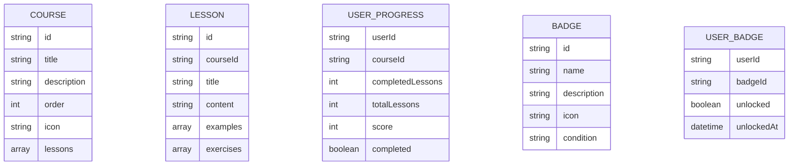

## 1. Architecture Design

```mermaid
graph TB
    subgraph "Frontend (React)"
        A[React App]
        B[Components]
        C[Pages]
        D[State Management]
        E[LocalStorage]
    end
    A --> B
    A --> C
    A --> D
    D --> E
    
    subgraph "Data Storage"
        F[课程数据]
        G[用户进度]
        H[成就数据]
    end
    
    subgraph "External Services"
        I[Cloudflare Pages]
    end
    
    E &lt;--&gt; F
    A --&gt; I
```

## 2. Technology Description
- 前端: React@18 + TypeScript + tailwindcss@3 + vite
- 初始化工具: vite-init
- 后端: 无（本地存储，免费版）
- 部署: Cloudflare Pages
- 状态管理: zustand
- 路由: react-router-dom
- Markdown渲染: react-markdown
- 图标: lucide-react
- 动画: framer-motion

## 3. Route Definitions
| Route | Purpose |
|-------|---------|
| / | 首页 |
| /courses | 课程体系 |
| /courses/:courseId/learn | 学习页面 |
| /courses/:courseId/practice | 练习页面 |
| /assessment/:assessmentId | 测评页面 |
| /achievements | 成就中心 |

## 4. Data Model

### 4.1 Data Model Definition


### 4.2 数据结构定义
```typescript
// 课程数据结构
interface Course {
  id: string;
  title: string;
  description: string;
  icon: string;
  lessons: Lesson[];
  order: number;
}

interface Lesson {
  id: string;
  title: string;
  content: string;
  examples: Example[];
  exercises: Exercise[];
}

interface Example {
  id: string;
  code: string;
  explanation: string;
}

interface Exercise {
  id: string;
  question: string;
  type: 'multiple-choice' | 'coding' | 'short-answer';
  options?: string[];
  answer: string;
  explanation: string;
}

interface Assessment {
  id: string;
  title: string;
  questions: Question[];
  timeLimit?: number;
}

interface Question {
  id: string;
  question: string;
  type: 'multiple-choice' | 'coding' | 'short-answer';
  options?: string[];
  answer: string;
  points: number;
}

interface UserProgress {
  [courseId: string]: {
    completedLessons: string[];
    score: number;
    completed: boolean;
  };
}

interface Badge {
  id: string;
  name: string;
  description: string;
  icon: string;
  condition: string;
}

interface UserBadges {
  [badgeId: string]: {
    unlocked: boolean;
    unlockedAt: number;
  };
}
```

### 4.3 课程内容配置
```typescript
// 商务数据分析课程体系
1. Python数据分析基础
2. Excel数据处理与分析
3. 数据可视化
4. 商务统计分析
5. SQL数据库查询
6. 数据分析实战案例
```
