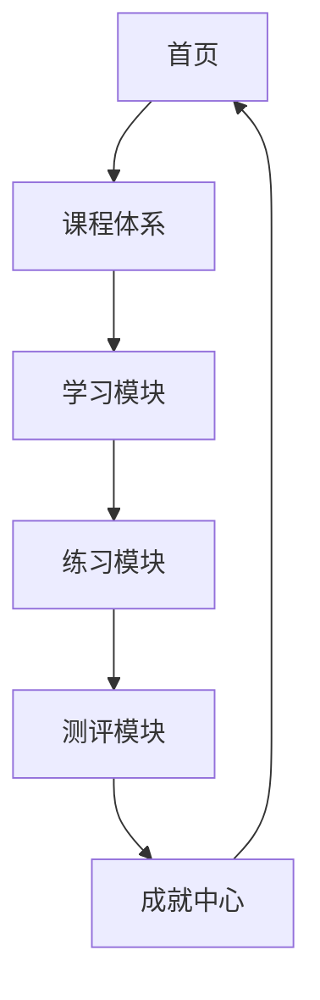

## 1. Product Overview
商务数据分析在线教育平台，为商务数据分析与应用专业学生提供完整的学习、练习、测评一体化解决方案
- 解决传统教材枯燥、缺乏实践互动的问题，提升数据分析学习效率
- 打造专业、有趣、成就感驱动的学习体验

## 2. Core Features

### 2.1 User Roles
| Role | Registration Method | Core Permissions |
|------|---------------------|------------------|
| 学员 | 本地存储（免费版） | 浏览课程、学习、练习、测评、查看成就 |

### 2.2 Feature Module
1. **首页**：英雄区域、导航栏、课程列表入口
2. **课程体系**：完整的课程目录、课程详情、学习进度
3. **互动学习**：知识点讲解、代码编辑器、实时反馈
4. **练习与测评**：练习题、测评卷、成绩报告
5. **成就激励**：积分系统、徽章展示、排行榜

### 2.3 Page Details
| Page Name | Module Name | Feature description |
|-----------|-------------|---------------------|
| 首页 | 英雄区域 | 动态渐变背景、平台介绍、开始学习按钮 |
| 首页 | 课程概览 | 卡片式课程展示、进度条、学习提示 |
| 课程体系 | 课程目录 | 树形结构、已完成标记、当前学习指示 |
| 课程体系 | 学习页面 | 知识点讲解、示例代码、练习区 |
| 练习测评 | 练习模块 | 交互式题目、即时反馈、解析查看 |
| 练习测评 | 测评模块 | 限时测试、自动评分、成绩报告 |
| 成就中心 | 成就展示 | 积分统计、徽章墙、学习时长统计 |
| 成就中心 | 排行榜 | 学习时长排名、积分排名 |

## 3. Core Process
用户访问平台 → 浏览课程体系 → 选择课程开始学习 → 完成互动学习模块 → 进行练习题巩固 → 参加测评检验 → 获取成就奖励

## 4. User Interface Design
### 4.1 Design Style
- 主色调：深蓝色 (#0F172A) + 蓝色渐变 (#3B82F6 → #8B5CF6)
- 辅助色：科技绿 (#10B981)、活力橙 (#F59E0B)
- 按钮风格：圆角矩形、悬浮阴影、点击反馈
- 字体：Noto Sans SC + Inter
- 布局风格：卡片式、层次感、充足留白
- 图标风格：Lucide React 线性图标

### 4.2 Page Design Overview
| Page Name | Module Name | UI Elements |
|-----------|-------------|-------------|
| 首页 | 英雄区域 | 渐变背景、动态波纹、大标题、CTA按钮 |
| 首页 | 课程概览 | 卡片网格、悬停放大、进度指示 |
| 课程体系 | 课程目录 | 侧边栏导航、展开/收起、完成标记 |
| 学习页面 | 内容区 | Markdown渲染、代码高亮、分步指引 |
| 练习页面 | 题目区 | 卡片式题目、输入框、提交按钮 |
| 成就页面 | 徽章墙 | 网格布局、解锁动画、徽章详情 |

### 4.3 Responsiveness
- 桌面优先设计，自适应平板和移动端
- 触摸优化：大点击区域、滑动手势
- 响应式断点：1280px、1024px、768px、480px

### 4.4 交互设计
- 页面切换动画
- 学习完成庆祝动画
- 徽章解锁特效
- 即时反馈提示
